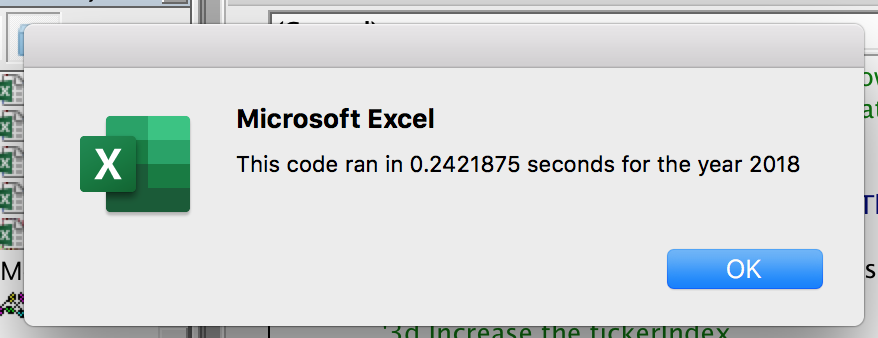

# Stock-Analysis
## Overview of Project
For this project, we are helping our friend Steve analyze stock data to determine which green energy stock would be the best investment for Steve’s parents. They are interested in investing in a specific green energy stock, “ DQ”. Using VBA, we analyzed the data to find that it was not the best stock to invest in. Using the same code, we analyzed other potential stocks to find better a better investment for Steve's parents. Although the code works well for analyzing a dozen stock data, it may not work well for thousands of stocks, and if it does, it may take a long time to execute. Thus, we need to refactor the same code to loop through the data faster to get the same results.   

## Results
From this data, we have calculated the total volume of each stock to determine how often each stock was traded from the beginning to the end of the year for each year we have been given data for – 2017 and 2018. Additionally, we are also looking for the percentage returned for each of the stocks over the year-long period. By looking at these two values, Steve will be able to better recommend which stock would be the best investment for his parents. 

In the chart below, we see that 2017 was a better year in terms of valuation. Each of the twelve stocks analyzed show they performed well except for one - “TERP”. Even “DQ”, the stock Steve’s parents were interested in investing show a 199.4% return. Although, if we take a look at the 2018 stock analysis, we see that “DQ” and many other of the stocks analyzed to have a decreased return rate. 

In terms of execution time for the analysis, the refactored code ran faster for both the 2017 and 2018 data sets. The refactored code completed the analysis in approximately 0.235 seconds for both years. The non refactored code completed the analysis in approximately .8633 seconds. 

#### Time it took to run original code

### Time it took to run refactored code

## Summary

### Advantages and Disadvantages of Refactoring Code

The purpose of refactoring code is not to add new functionality but increases the efficiency of the code. The advantage of refactoring code is that it makes it cleaner and easier to read for you and the program, especially when running code over thousands of rows of data. The only disadvantage is that you increase the chance of introducing bugs into the code. 

### How do these pros and cons apply to refactoring the original VBA script?

Not only does the refactored code have a cleaner and better format that is easier to read line by line, but it improves the efficiency of the code. If you look at the original script conditionals used to run the analysis of each stock's total volume, starting price, and ending price, you can see it is less efficient than the refactored codes conditionals as the computer is taking longer going through the for loops from the first code. In comparison to the refactored code, we are using if statements to quickly check if that row has that specific data we are looking for. If so, it will pull the requested data and if not, it will continue to go through the data until the code ends.  

### Original Script

### Refactored Script

